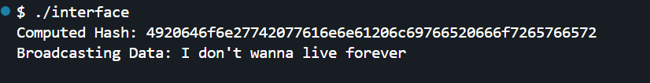

This Go program defines a **custom reader** (`hashReader`) that reads data while also computing its **hex-encoded hash**.  

1. **Creates a `hashReader`** that wraps a byte buffer and allows reading the data.  
2. **Implements a `hash()` method** to return a unique hash (hex representation of data).  
3. **Passes the reader to `hashAndBroadcast()`**, which:
   - Prints the computed hash.
   - Reads and prints the original data.  
4. **Demonstrates usage in `main()`** by creating a `hashReader` with a sample text and broadcasting it.  

---

### **How is This Useful?**
🔹 **Data Integrity Checks**: Ensures data remains unchanged by verifying hashes.  
🔹 **Efficient Streaming**: Allows reading and hashing in a single pass.  
🔹 **Security & Validation**: Can be extended for cryptographic verification before data transmission.  

This pattern is useful in **networking, file processing, and blockchain applications** where you need to **read, verify, and transmit** data efficiently.

