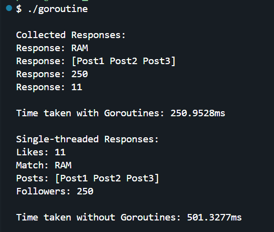

This Go program demonstrates how Goroutines improve execution speed by fetching user-related data (likes, matches, posts, and followers) concurrently. It uses a `sync.WaitGroup` to manage multiple Goroutines and a buffered channel to collect responses. The program also compares execution time with and without Goroutines, showcasing the efficiency of concurrency.

