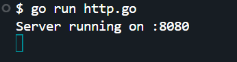
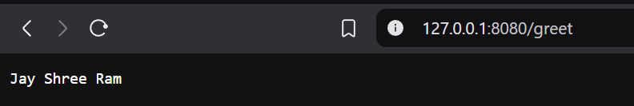

#### **Run the HTTP Server**

1. Open **Git Bash** in the project directory.  
2. Run the following command to start the server:  
   ```sh
   go run http.go
   ```
3. The server will start on **port 8080**, and you'll see:
   ```sh
   Server running on :8080
   ```

#### ** Test the Endpoint **
- Open another terminal and run:
  ```sh
  curl http://localhost:8080/greet
  ```
- Or else open browser on 
``` 127.0.0.1:8080/greet

- **Expected Output:**
  ```
  Jay Shree Ram
  ```

This project is a simple HTTP server in Go that handles a **GET** request to return `"Jay Shree Ram"` as a response. It includes unit tests using `httptest` to validate the server's behavior.




