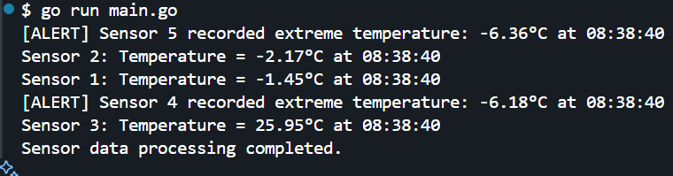

| Usage | Purpose | Why Pointers? |
|--------|---------|--------------|
| `*SensorData` return type | Avoids copying large sensor data | Only 8 bytes are passed instead of full struct |
| `processSensorData(*SensorData, *sync.WaitGroup)` | Modifies actual data and synchronizes goroutines | Prevents redundant memory allocation |
| `&wg` in `main()` | Ensures proper goroutine synchronization | Modifies the same WaitGroup across functions |

--- 

