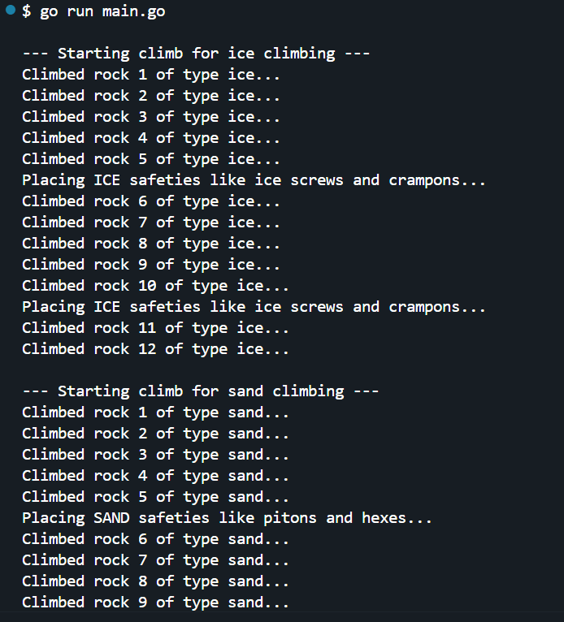

This Go program demonstrates **dependency injection (DI)** by allowing `RockClimber` to use different `SafetyPlacer` strategies dynamically, making the code **modular, scalable, and testable**. It follows **SOLID principles**, ensuring that new climbing safety types can be added without modifying existing logic. This approach is useful in **enterprise applications, game development, and robotics**, where different implementations need to be injected flexibly.

