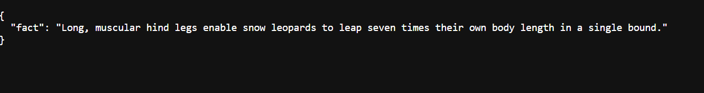

# Cat Fact Microservice

A simple Go microservice that fetches random cat facts.

## Features
- Fetches a cat fact from `https://catfact.ninja/fact`
- Includes logging middleware
- REST API with `/fact` endpoint

```sh
make run


